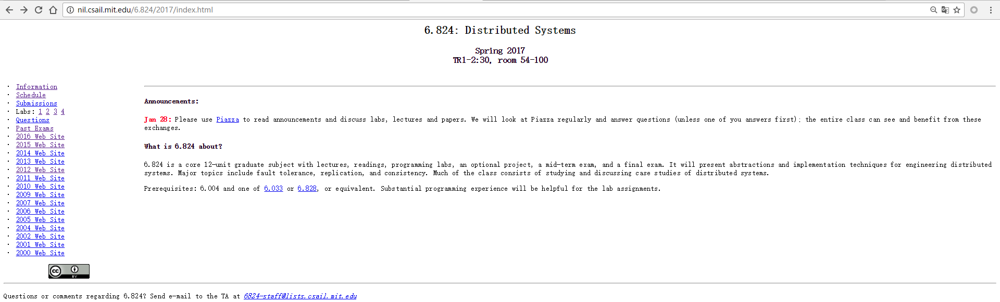

####本项目主要针对自己对MIT6.824课程学习和翻译的记录，也方便后续其他学习者作为参考。
有些内容也会记录在博客网址：[https://my.oschina.net/tantexian/blog](https://my.oschina.net/tantexian/blog)

##[MIT6.824网址](http://nil.csail.mit.edu/6.824/2017/)

6.824: Distributed Systems

Spring 2017
TR1-2:30, room 54-100

6.824是麻省理工学院的、关于分布式系统的编程实验课程。主要包括容错、复制、一致性等内容，总共包括23次课，4次试验及2次考试。

左上角链接补充解释：
* Information：课程的介绍。
* Schedule：课程表安排，安排了第1课到23课的排课日期及每次课程教授的内容及课程内容介绍和考试（包括提前需要准备的基础知识及布置的作业）。
* Submissions：课程答题入口，注册自己的账号。
* Labs: 1 2 3 4：表示本次课程需要完成的四个实验。
* Questions：问答。
* Past Exams：往年考试试卷及答案。
* 2000 Web Site - 2016 Web Site：2000年-2016年以往6.824课程网址。